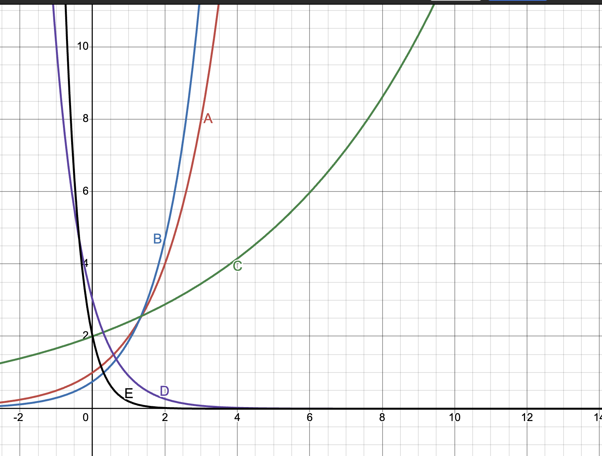
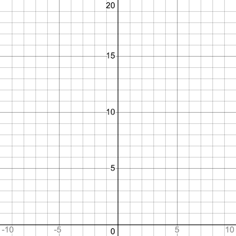

[comment]: render
[comment]: grid
# Lesson: Mastering Exponential and Logarithmic Functions

## Part I: The Laws of Exponents

Review the rules:

- $a^m \cdot a^n = a^{m+n}$

- $\frac{a^m}{a^n} = a^{m-n}$

- $(a^m)^n = a^{mn}$

- $a^0 = 1$

- $a^{-n} = \frac{1}{a^n}$

### Practice

1. Simplify: $\frac{x^5 + x^{-\frac{3}{2}}}{x^{\frac{1}{2}}}$  

\vspace{3cm}

2. Simplify: $(x^2y^{-1})^3$  

\vspace{3cm}

3. Simplify: $\frac{(3x^2)^4}{9x^5}$  

\vspace{3cm}

4. Simplify: $\frac{ab}{a^{-1}-b^{-2}}$  

\vspace{3cm}

5. Simplify: $5^3 \cdot 5^{-1} \cdot 5^0$ 

\vspace{3cm}

6. Simplify: $\frac{x^{-2}}{x^4}$  

\vspace{3cm}

7. Simplify: $(2x^{-1})^3$

\vspace{3cm}

8. Simplify: $\frac{y^3z^{-2}}{z^{-4}y^{-1}}$  

\vspace{3cm}

9. Simplify: $\left(\frac{m^3n^{-1}}{m^{-2}n^2}\right)^2$

---

## Part II: Growth Models – Discrete and Continuous

### A. Compound Interest Formulas

- **Compounded periodically:**
  $$
  A = P\left(1 + \frac{r}{n}\right)^{nt}
  $$

- **Compounded continuously:**
  $$
  A = Pe^{rt}
  $$

### Practice

10. $\$500$ invested at 6% interest compounded quarterly for 8 years

\vspace{3cm}

11. $\$1,000$ invested at 5.5% interest compounded continuously for 10 years 

\vspace{3cm}

12. $\$2,500$ at 7% compounded monthly for 5 years  

\vspace{3cm}

13. $\$800$ at 4.5% compounded annually for 3 years

\vspace{3cm}

14. $\$6,000$ at 3.25% compounded daily for 15 years 

\vspace{3cm}

15. $\$100$ grows to $\$180$ in 6 years with continuous compounding. What was the rate?

\vspace{3cm}

### B. Rule of 72

16. Estimate doubling time at 9% interest 

\vspace{3cm}

17. Estimate doubling time at 6% interest  

\vspace{3cm}

18. Estimate doubling time at 3% interest

\vspace{10cm}

---

## Part III: Graphing Exponential and Logarithmic Functions

### General Behavior

- Exponential: $f(x) = a \cdot b^x$
  - Domain: $(-\infty, \infty)$
  - Range: $(0, \infty)$

- Logarithmic: $g(x) = \log_b(x)$
  - Domain: $(0, \infty)$
  - Range: $(-\infty, \infty)$

### Practice

19. Sketch and label $f(x) = 2^x$  

\vspace{3cm}

20. Sketch and label $f(x) = 0.5^x$  

\vspace{3cm}

21. Sketch and label $g(x) = \log_2(x)$

\vspace{3cm}

22. Sketch and label $g(x) = \log_{10}(x)$  

\vspace{3cm}

23. Sketch and label $h(x) = \ln(x)$  

\vspace{3cm}

24. Identify the domain and range of $y = \log_3(x - 1)$ 

\vspace{3cm}

25. Identify the asymptote and intercepts for $y = 5^x$ 

\vspace{3cm}

26. Graph $y = 3 \cdot 2^{-x} + 1$ and label key features

---

## Part IV: Laws of Logarithms

- $\log_b(MN) = \log_b(M) + \log_b(N)$  
- $\log_b(M/N) = \log_b(M) - \log_b(N)$  
- $\log_b(M^p) = p \cdot \log_b(M)$

### Practice

27. Expand: $\log_3(9x^2)$  

\vspace{3cm}

28. Expand: $\log_5(25y^3)$ 

\vspace{3cm}

29. Expand: $\ln(x^2y/z)$  

\vspace{3cm}

30. Combine: $\ln(x) + \ln(4)$ 

\vspace{3cm}

31. Combine: $2\log_3(x) - \log_3(5)$ 

\vspace{3cm}

32. Combine: $\log_2(a) + \frac{1}{3} \cdot \log_2(b) - 3\log_2(c)$ 

\vspace{3cm}

33. Simplify: $\log_{10}(0.001)$  

\vspace{3cm}

34. Simplify: $\ln(e^4)$ 

\vspace{3cm}

35. Simplify: $\log_5(\sqrt{125})$

---

## Part V: Solving Exponential and Logarithmic Equations

### Practice

36. Solve: $3^x = 80$  

\vspace{3cm}

37. Solve: $e^{2x} = 10$

\vspace{3cm}

38. Solve: $\log_5(x) = 2$ 

\vspace{3cm}

39. Solve: $\log_4(x + 1) = 3$  

\vspace{3cm}

40. Solve: $4^{x^2 - \frac{1}{2}x} = 2$ 

\vspace{3cm}

41. Solve: $\ln(x+7) = 2$  

\vspace{3cm}

42. Solve: $10^{2x} = 500$ 

\vspace{3cm}

43. Solve: $5^{x+1} = 75$ 

\vspace{3cm}

44. Solve: $\log_2(3x - 1) = 4$

\vspace{3cm}

## Part V-B: Solving Exponential Equations Using Substitution
Use substitution to transform the equation into a quadratic. Let $u = e^x$ or $u = a^x$, solve the quadratic, then solve for $x$.

**Practice**
45. Solve: $e^{2x} - 2e^x - 8 = 0$

\vspace{3cm}

46. Solve: $4^x + 3 \cdot 2^x - 10 = 0$

\vspace{3cm}

47. Solve: $2^{2x+1} - 5\cdot2^{x} + 2 = 0$

\vspace{3cm}

---

## Part VI: Reflection

- How do the graph shapes of exponential and logarithmic functions relate?  

\vspace{3cm}

- When is it better to use continuous vs. periodic compounding?

\vspace{3cm}

- How does understanding the log rules help you solve equations?
